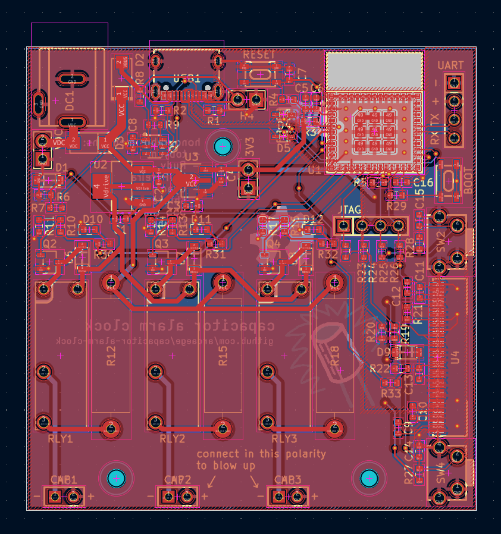
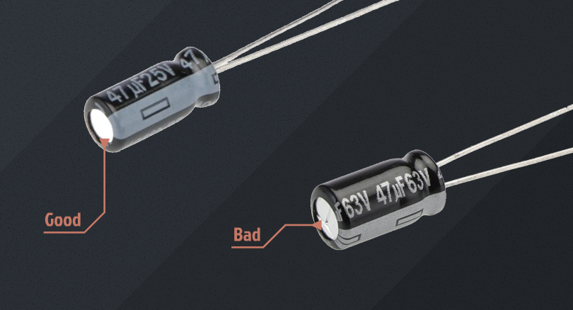
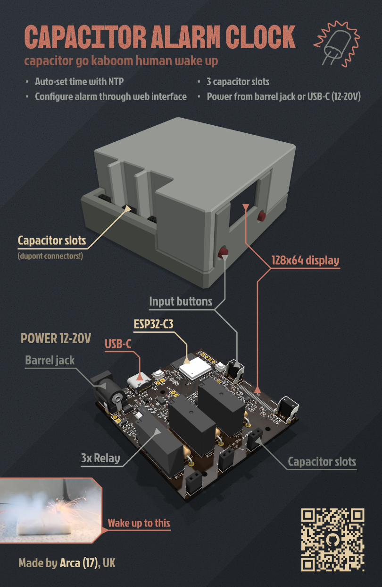

    <h1>
        capacitor alarm clock
    </h1>
    

        <strong>
            wake up to the bang of a capacitor going off
        </strong>
    

    

        <a href="#features">Features</a> •
        <a href="#pcb">PCB</a> •
        <a href="#cad-files">CAD</a> •
        <a href="#building--flashing-firmware">Firmware</a> •
        <a href="#usage">Usage</a>
    

    
    

## Features

- ESP32-powered
  - Configure settings via the webserver
  - Fetch time automatically via NTP
- 128x64 SSD1315 display
- 3 separate capacitor slots
- Up to 3A through the capacitors
  - 10 ohm current limiting resistors to avoid brownouts if the capacitor shorts
- Power via USB-C or barrel jack (12-20V)
- Small size (72x74x36mm)

> [!WARNING]
> Take care when using this, and only do so if you know what you're doing. Capacitor explosions are quite violent and the fumes aren't nice to breathe. This project is mostly a high-effort joke

## PCB

Images of schematics and more are under the [PCB README](pcb/README.md). A BOM is available under [production](production/). I'd recommend using [JLCPCB](https://jlcpcb.com/) as they seem to have the lowest prices.

## CAD files

CAD files for the shell and PCB are under [`cad/`](cad/)

## Building + flashing firmware

To build and flash the firmware, you'll need to use PlatformIO. Install the VSCode extension and open the firmware folder, then follow the instructions in the [firmware README](firmware/README.md).

## Usage

Once flashed and connected to WiFi, the display will show the current time. You can go into the settings by pressing "select" (done by pressing both buttons at once). From there, you can use the left and right buttons to go up and down and set the alarm time, schedule, next capacitor slot and more. You can also go into the "about" page to see the clock's IP.

Once you have the IP, you can go to the web interface at `http://<IP>/`. Note: some browsers might only try HTTPS (looking at you Firefox), so you'll need to manually enter the `http://` part.

## Sourcing capacitors

When choosing capacitors, you should avoid capacitors with these pressure release slots at the top, as they will reduce the bang. Choose the biggest capacitor you can get that has no top slot.

Also try to go as low as possible with the voltage rating to increase reliability, ~16V is where you should aim. [These capacitors](https://www.lcsc.com/product-detail/C22320.html) from LCSC are pretty good, at $3 for 200.

## Magazine page

This project was submitted to [Hack Club Fallout](https://fallout.hackclub.com)! Here's the page for the Fallout magazine:

