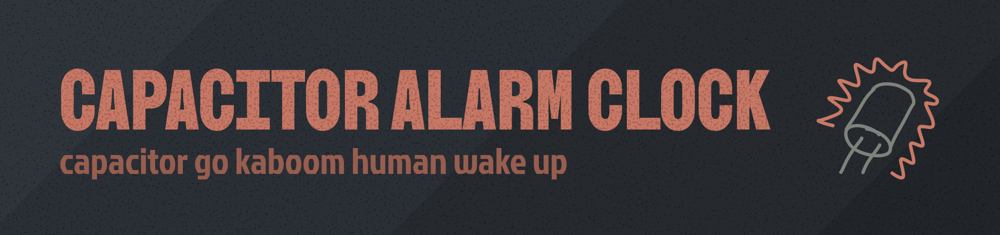
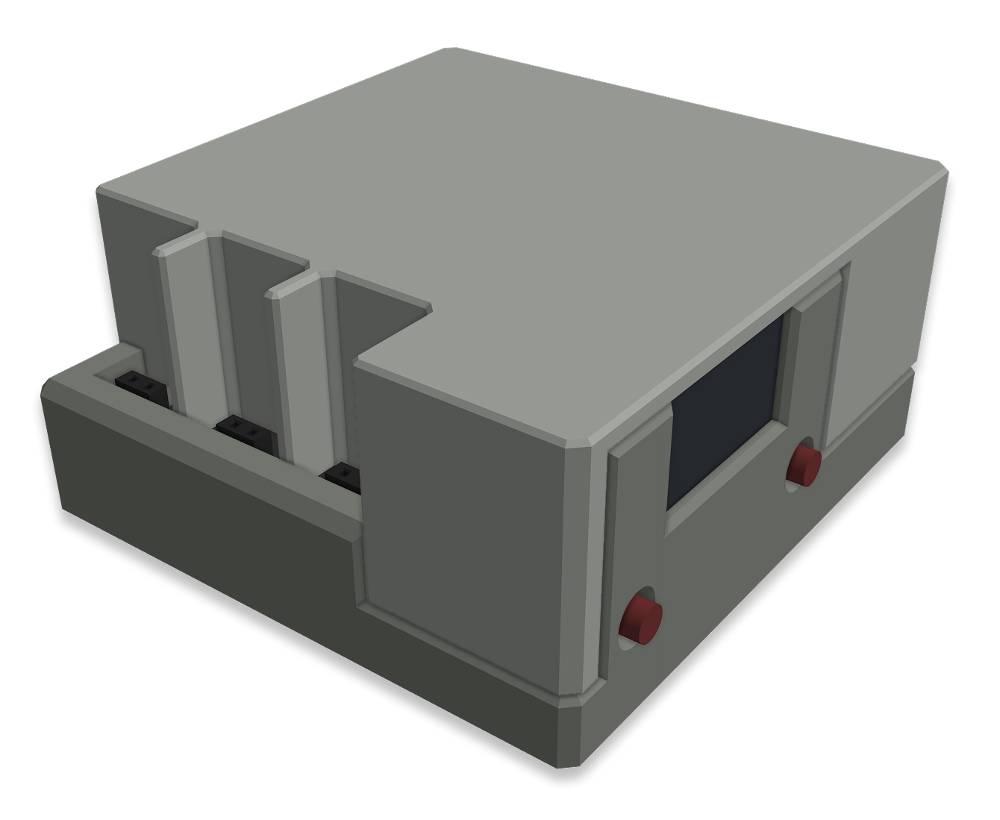
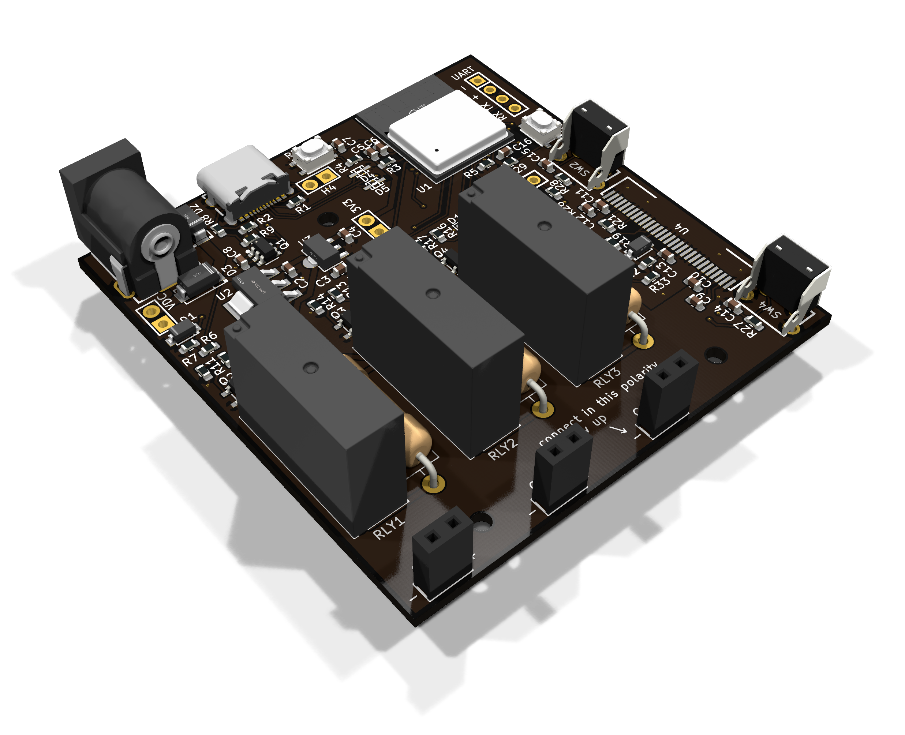

    <h1>
        capacitor alarm clock
    </h1>
    

        <strong>
            wake up to the big bang of a capacitor going off
        </strong>
    

    

        <a href="#key-features">Features</a> •
        <a href="#pcb">PCB</a> •
        <a href="#building--flashing-firmware">Firmware</a>
    

    
    

## Features

- ESP32-powered
    - Configure settings via the webserver
    - Fetch time automatically via NTP

## PCB

## Building + flashing firmware

## Magazine page
