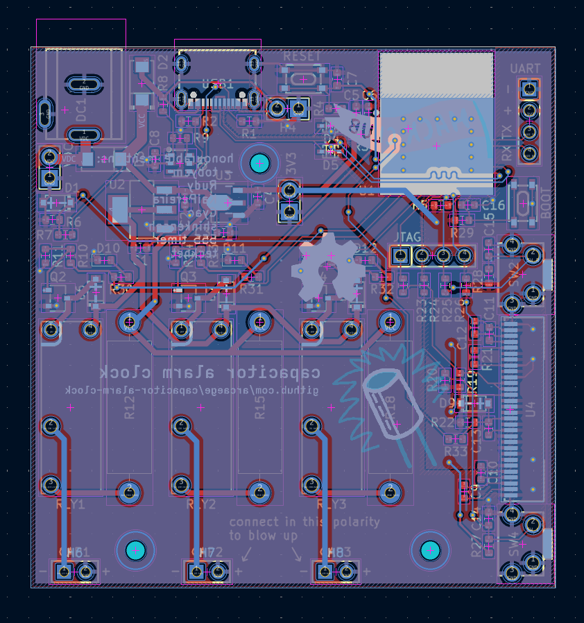
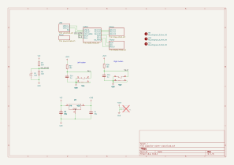
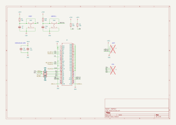
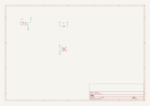
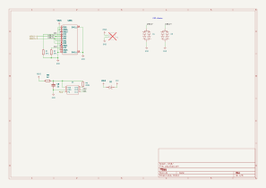
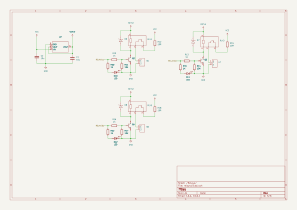
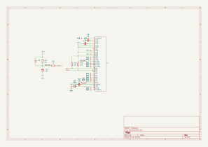

# PCB files

If you're looking for the production files, they're under [`../production/`](../production/)

## PCB

### Front

### Back

## Schematics

I used hierarchical schematics whilst designing this, this is split into multiple files

### `capacitor-alarm-clock.kicad_sch`

### `esp32.kicad_sch`

### `power.kicad_sch`

### `usb.kicad_sch`

### `relays.kicad_sch`

### `display.kicad_sch`

