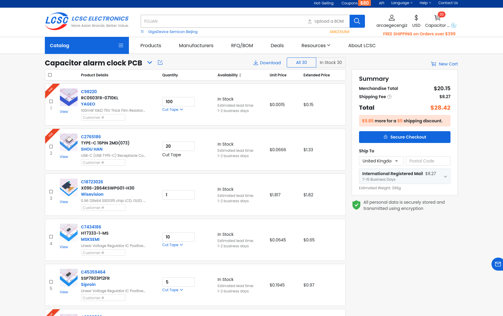
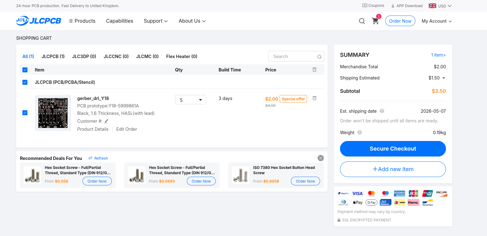

# Production files

## BOM

- [`bom_pcb_components.csv`](bom_pcb_components.csv) - BOM for the PCB components
- [`bom_lcsc.xls`](bom_lcsc.xls) - BOM exported from LCSC; contains same info as `bom_pcb_components.csv` but with prices
- [`bom_general.csv`](bom_general.csv) - general BOM with prices

All the electrical components are from LCSC, as it's cheaper.

### LCSC cart

## Gerbers & drill files

Under `gerber_drl` and also as a zip at `gerber_drl.zip`

### JLCPCB cart

JLCPCB seems to be the best place to order this, at $2 before shipping:

